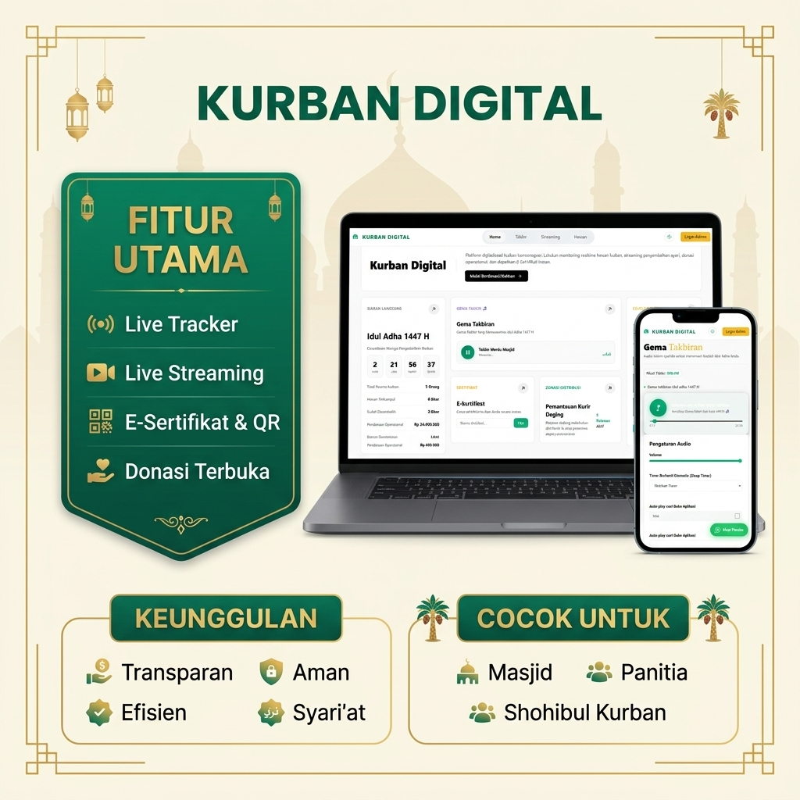

# 🐪 KURBAN DIGITAL



**Kurban Digital** adalah sebuah platform manajemen ibadah kurban modern yang dirancang khusus untuk DKM Masjid, Yayasan, dan Panitia Kurban. Aplikasi ini memungkinkan para donatur (shohibul kurban) untuk memantau status penyembelihan secara *real-time*, transparan, dan bahkan menyaksikan prosesnya lewat *live streaming*.

---

## 🌟 Fitur Utama

- 📊 **Live Tracker Realtime:** Status penyembelihan dari persiapan hingga distribusi langsung terlihat di dashboard.
- 🎥 **Integrasi Live Streaming (TikTok):** Shohibul kurban bisa menonton langsung proses penyembelihan kurban mereka.
- 📜 **E-Sertifikat & QR Code:** Dapatkan tanda terima donasi dan bukti sah penyembelihan yang bisa di-*scan*.
- 🔒 **Privasi Terjamin & Amanah:** Sistem terenkripsi penuh dan menerapkan standard operasi yang sesuai dengan syari'at.
- 📈 **Manajemen Data Otomatis:** Otomatisasi sinkronisasi data donatur tanpa harus input manual pakai kertas.

---

## 💻 Tech Stack

Proyek ini dibangun menggunakan arsitektur web modern yang ringan namun kuat:

- **Frontend:** HTML5, CSS3, Vanilla JavaScript
- **Backend / Realtime:** Node.js, Express.js, Socket.IO
- **Database / API:** Google Apps Script (GAS) & Google Sheets
- **Streaming Proxy:** TikTok Live Connector
- **DevOps & Security:** Docker (Multi-stage build), JS Obfuscator, Vercel

---

## 🚀 Panduan Instalasi & Deploy

### A. Konfigurasi Database (Google Apps Script)
Sebelum menjalankan aplikasi, Anda WAJIB mengatur backend Google Sheets.
Silakan baca panduannya di: [PANDUAN_GAS.txt](PANDUAN_GAS.txt)

### B. Menjalankan di Local (Development)
Jika Anda hanya ingin menjalankan di komputer lokal:
```bash
npm install
npm run dev
```
Akses web di: `http://localhost:8083`

### C. Deploy ke VPS / Server Pribadi (Sangat Disarankan)
Aplikasi ini dilengkapi dengan perlindungan keamanan Docker tingkat tinggi (Obfuscation, Read-Only Container, No-New-Privileges).
Hanya kompatibel dengan sistem yang sudah terinstall Docker:

```bash
# Untuk Windows (PowerShell)
npm run docker:deploy

# Untuk Linux / Mac
bash deploy.sh
```

### D. Deploy ke Vercel (Hosting Serverless Gratis)
Jika tidak memiliki server pribadi, Anda bisa menggunakan Vercel:
1. Push repositori ini ke akun GitHub Anda.
2. Login ke Vercel dan buat *New Project* dari repositori ini.
3. Vercel akan otomatis menjalankan obfuscation (`node build.js`) dan mendesploy web Anda.
Atau lewat terminal:
```bash
npm run deploy:vercel
```

---

## 🛡️ Keamanan & Proteksi Kode

Aplikasi ini menggunakan sistem **Code Obfuscation** saat di-*build*. Source code yang ada di dalam folder `src/` tidak akan bisa diintip atau diekstraksi dari dalam Docker container (ataupun dari Vercel public access) karena sistem hanya akan melayani file *compiled* yang sudah diacak dan dienkripsi rumit.

---
**Dibuat dengan ❤️ untuk digitalisasi umat.**
